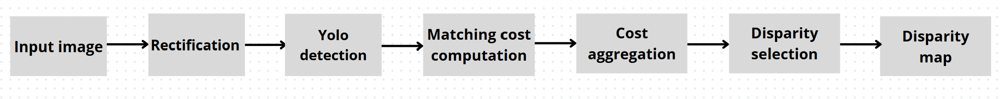

# StereoSense

## Overview  
StereoSense combines **YOLOv8 object detection** with **stereo vision** to detect objects and estimate their distances using a **Loitor VI stereo camera**. The pipeline includes image rectification, disparity map generation, object detection, and depth estimation through triangulation.

---

## Pipeline  

1. **Camera Calibration:** Extract intrinsic and extrinsic parameters via chessboard pattern.  
2. **Image Rectification:** Align stereo images using SIFT keypoints and fundamental matrix.  
3. **Disparity Computation:** Use StereoSGBM with fixed window cost aggregation for disparity map.  
4. **Disparity Selection:** Compute median disparity in a 5×5 window around each detected object's center.  
5. **Depth Estimation:** Calculate distance via triangulation from disparity and camera parameters. 

---

## Results Visualization

- Original left image with detected objects and distance annotations  
- Rectified stereo images  
- Disparity and depth maps  

---

